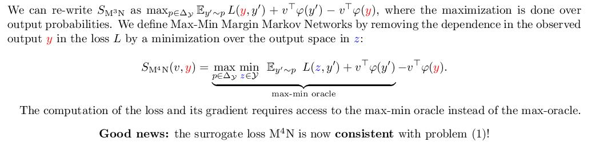

# Max-Min Margin Markov Networks (M<sup>4</sup>Ns)
Code accompanying [Consistent Structured Prediction with Max-Min Margin Markov Networks](https://arxiv.org/pdf/2007.01012.pdf) published at ICML 2020


## Summary of the paper

### Abstract and contributions

It is known that the widely used Structural SVM ([Tsochantaridis et al., 2005](http://www.jmlr.org/papers/volume6/tsochantaridis05a/tsochantaridis05a.pdf)) or Max Margin Markov Network (M<sup>3</sup>N) ([Taskar et al., 2004](https://papers.nips.cc/paper/2397-max-margin-markov-networks.pdf)) is **not consistent** in structured prediction. In this paper we present Max-Min Margin Markov Networks (M<sup>4</sup>Ns) a correction of the M<sup>3</sup>N loss where the max margin is changed into a max-min margin.

Contributions:
 - **Consistency** and a **finite-sample generalization bound** for the regularized empirical risk minimizer.
 - **Algorithm** based on Block-Coordinate Frank-Wolfe and Saddle-Point Mirror-Prox **with strong guarantees**.
 - A **Python implementation** for the tasks of multi-class classification, ordinal regression, sequence prediction and ranking.

### Structured Prediction setting


### Surrogate Methods and consistency


### Max Margin and its inconsistency


### Max-Min Margin and its consistency



### Approximating the max-min oracle with a projection oracle


## Run the Code

### Requirements

- Computer with Linux or OSX
- Python 3.7.7 + some traditional packages
- Cython 0.29.15+ (used for fast inference)

### Get datasets folder 

Get the datasets for multi-class classification, ordinal regression, sequence prediction and ranking:
- Get the datasets folder from the following link ([link to drive](https://drive.google.com/file/d/1auzKzZh-vAaN9JmspEyNnX5rum0HimfR/view?usp=sharing)). 
- Create folder ```struntho/datasets```

### Compile project
Run the Makefile:
```
make all
```

### Run experiments
Run: 
```
python main.py \
   --task [options: multiclass/ordinal/sequence/ranking]  # choose structured prediction task
   --model [options: m3n/crf/m4n]  # choose model to run
   --dataset [satimage (example from multilcass)]  # set an available dataset for the chosen task 
   --add_bias  # add bias to the linear model
   --cython  # use the compiled version for fast inference
   --reg [float]  # regularization parameter lambda
   --check_dual_every [int]  # frequency of computing the dual gap
   --iter_oracle [int]  # iterations of saddle-point mirror-prox to compute the oracle
   --kernel  # not applicable to sequence prediction
   --epochs [int]  # number of passes over the training dataset
```
As an example:
```
python main.py --task multiclass --model m4n --dataset segment --add_bias --cython --reg 0.001 --check_dual_every 10 --iter_oracle 20 --kernel --epochs 101
```

### Author
- Alex Nowak-Vila, 2020.
